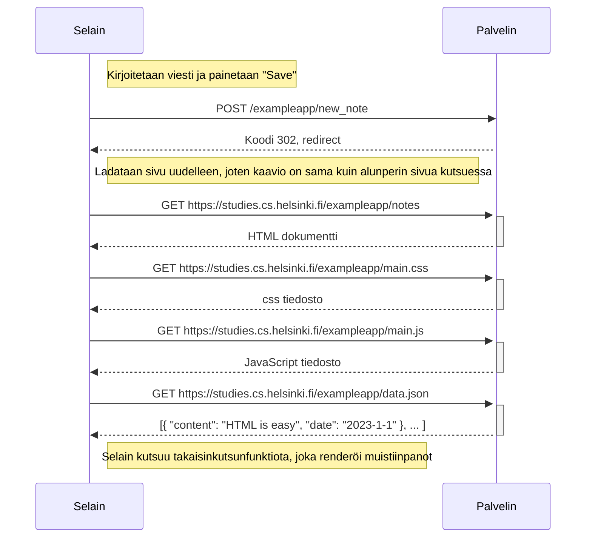

```mermaid
sequenceDiagram
    participant Selain
    participant Palvelin

    Note right of Selain: Kirjoitetaan viesti ja painetaan "Save"

    Selain->>Palvelin: POST /exampleapp/new_note
    activate Palvelin
    Palvelin-->>Selain: Koodi 302, redirect

    Note right of Selain: Ladataan sivu uudelleen, joten kaavio on sama kuin alunperin sivua kutsuessa

    Selain->>Palvelin: GET https://studies.cs.helsinki.fi/exampleapp/notes
    activate Palvelin
    Palvelin-->>Selain: HTML dokumentti
    deactivate Palvelin
    
    Selain->>Palvelin: GET https://studies.cs.helsinki.fi/exampleapp/main.css
    activate Palvelin
    Palvelin-->>Selain: css tiedosto
    deactivate Palvelin
    
    Selain->>Palvelin: GET https://studies.cs.helsinki.fi/exampleapp/main.js
    activate Palvelin
    Palvelin-->>Selain: JavaScript tiedosto
    deactivate Palvelin
    
    Selain->>Palvelin: GET https://studies.cs.helsinki.fi/exampleapp/data.json
    activate Palvelin
    Palvelin-->>Selain: [{ "content": "HTML is easy", "date": "2023-1-1" }, ... ]
    deactivate Palvelin    

    Note right of Selain: Selain kutsuu takaisinkutsunfunktiota, joka renderöi muistiinpanot

```
