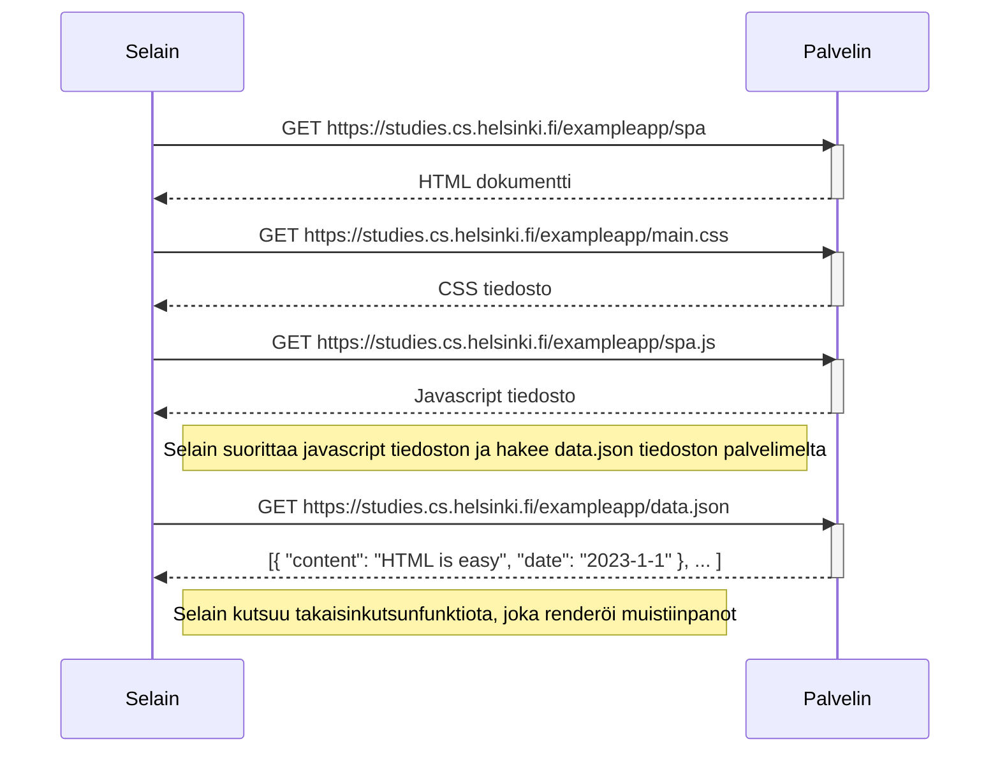

```mermaid

sequenceDiagram
    participant Selain
    participant Palvelin

    Selain->>Palvelin: GET https://studies.cs.helsinki.fi/exampleapp/spa
    activate Palvelin
    Palvelin-->>Selain: HTML dokumentti
    deactivate Palvelin

    Selain->>Palvelin: GET https://studies.cs.helsinki.fi/exampleapp/main.css
    activate Palvelin
    Palvelin-->>Selain: CSS tiedosto
    deactivate Palvelin

    Selain->>Palvelin: GET https://studies.cs.helsinki.fi/exampleapp/spa.js
    activate Palvelin
    Palvelin-->>Selain: Javascript tiedosto
    deactivate Palvelin

    Note right of Selain: Selain suorittaa javascript tiedoston ja hakee data.json tiedoston palvelimelta

    Selain->>Palvelin: GET https://studies.cs.helsinki.fi/exampleapp/data.json
    activate Palvelin
    Palvelin-->>Selain: [{ "content": "HTML is easy", "date": "2023-1-1" }, ... ]
    deactivate Palvelin 

    Note right of Selain: Selain kutsuu takaisinkutsunfunktiota, joka renderöi muistiinpanot 
    


```
